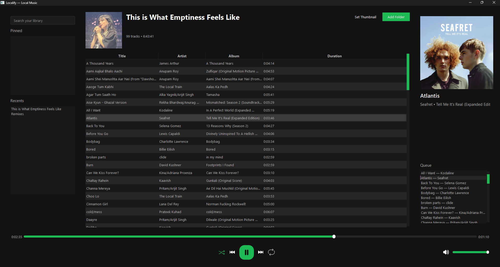

# Localify — Local Spotify-like Desktop Player

Localify is a lean, dark-themed desktop music player that treats folders as playlists. It focuses on fast local playback, a clean UI, and intuitive folder-based library management — inspired by Spotify’s layout, but built for files you own.



## Why choose Localify?
- Elegant, responsive three-panel UI (library / tracks / now playing)
- Plays local audio files (MP3, WAV, FLAC, OGG, M4A) with metadata and album art
- Folder-as-playlist model: add or drop folders; they become playlists instantly
- Playback features: gapless/crossfade, shuffle, repeat, per-track position memory, and basic EQ presets

## Quick start
### Windows
1. **Install:**
   - Double-click `install.bat` for a guided installation with progress bar and dialog. This will set up Python and dependencies if needed.
2. **Run:**
   - Double-click `run.bat` to launch Localify. The launcher auto-detects Python and virtual environments, and opens the app in a new window.

### Linux/macOS
1. **Install dependencies:**
   ```bash
   python3 -m venv .venv
   source .venv/bin/activate
   python setup.py
   ```
2. **Run:**
   ```bash
   ./run.sh
   ```
   - The script auto-detects Python and virtual environments, launching the app via `python -m MusicPlayer`.

## Core features
- Folder-based playlists (recursive scanning)
- Play / Pause / Next / Previous, keyboard and media-key support
- Compact volume control with mute, seek and a responsive progress bar
- Shuffle, repeat (off / one / all) and configurable crossfade
- Metadata extraction and album art display
- Remember last-played position per track and per-folder
- Pin favorite folders and access recent folders quickly

## Developer notes
- Entry point: `MusicPlayer/__main__.py`
- UI: `MusicPlayer/ui/` (main_window.py, components.py)
- Core: `MusicPlayer/core/` (audio_player.py, folder_manager.py, metadata_handler.py, settings.py)

## Project layout (top-level)
```
MusicPlayer/
├─ MusicPlayer/        # package
├─ requirements.txt
├─ setup.py
├─ run.bat            # Windows launcher
├─ run.sh             # Linux/macOS launcher
├─ install.bat        # Windows installer (progress bar)
└─ README.md
```

## Tips & troubleshooting
- **Windows:** If Python is missing, `install.bat` will download and install it automatically.
- **Linux/macOS:** Ensure you have Python 3.8+ and all dependencies installed.
- Audio not playing? Ensure `pygame` is installed and your audio device is available.
- No album art? The file may not contain embedded artwork — try a tag editor.
- Large libraries: initial scan can take time; metadata is cached for faster reloads.

## Contributing
- Fork, branch, implement, and open a PR. Keep changes focused and add tests where appropriate.

## License
- MIT — see the LICENSE file.

## Need help?
- Open an issue with steps to reproduce and any logs (run with `--debug` to enable verbose logging).

Enjoy your music — locally and beautifully.